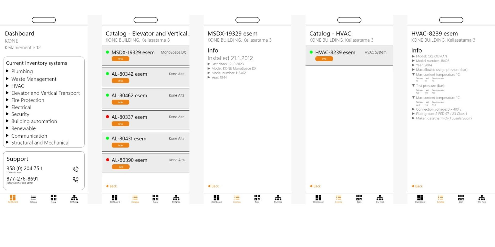
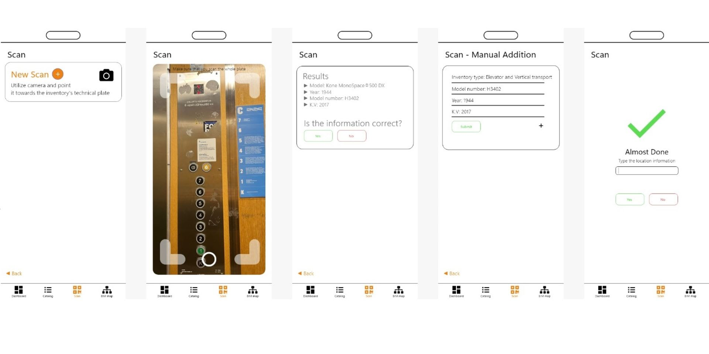

# InvenTech

## Equipment inventory management software solution

Hello! In this readme you will find a brief description of the code and tech stack that was used to create the project.

### Challenge Addressed
InvenTech Solutions tackles the complex challenge of inventory management in any buildings by streamlining the process of data collection and centralization. Facility managers, technicians, and property owners often face difficulties in tracking, managing, and updating inventory data across diverse equipment and building systems. This leads to outdated records, inefficient maintenance schedules, and increased downtime. InvenTech Solutions solves this problem with an innovative app that simplifies and automates inventory data collection from technical plates, effortlessly transferring it to a centralized data center.

### Solution Overview
InvenTech’s app is designed with a focus on simplicity, allowing users of any technical background to accurately collect and update inventory data. Users can scan technical plates directly on-site, enabling real-time data capture of equipment details such as model numbers, serial numbers, manufacturer information, and specifications. With this data instantly transmitted to a secure data center, our solution eliminates manual entry errors, significantly reduces the time spent on inventory management, and ensures that critical asset information is always up to date.

#### TLDR

This software aims to simplify and automate the process of collecting data on new equipment, and auditing existing equipment in buildings.

#### Tech stack

- <ins>[AngularJS](InventTek/README.md)</ins>:
    - a popular and reliable enterprise-level frontend framework
    - used to create the web application to carry out task of equipment inventory management
    - queries data on equipment from the server and allows the user to scan technical plates using a camera for further automated image processing
    - alternatively, can be replaced by a native mobile app for IOS and Android

- <ins>[Python](image-text-extractor-python/text_extractor_v2.py)</ins>:
    - a script that sends an image via an API call to 
Google Vision, where the image gets processed
    - the API returns a text which was recognized on the image
    - the text then gets processes in python where the key information is picked out (e.g. model number, manufacturer)

- <ins>[Go](junction2024-server-go/main.go)</ins>:
    - a Go server receives the equipment data from the python script
    - data is then parsed and passed onto the database to be saved
    - additionally, the server provides the API endpoints to query, create and delete data from the database

## Images

### Team
- [Kirill Sirotkin](https://www.linkedin.com/in/kirill-sirotkin/)
- [Chad Clusker](https://www.linkedin.com/in/chad-clusker/)
- [Dylan Camporotondo](https://www.linkedin.com/in/dylan-camporotondo-b6a199275/)
- [Andrey Gurevich](https://www.linkedin.com/in/andrey-gurevich-888595169/)
- [Rene Kärkkäinen](https://www.linkedin.com/in/renekarkkainen/)